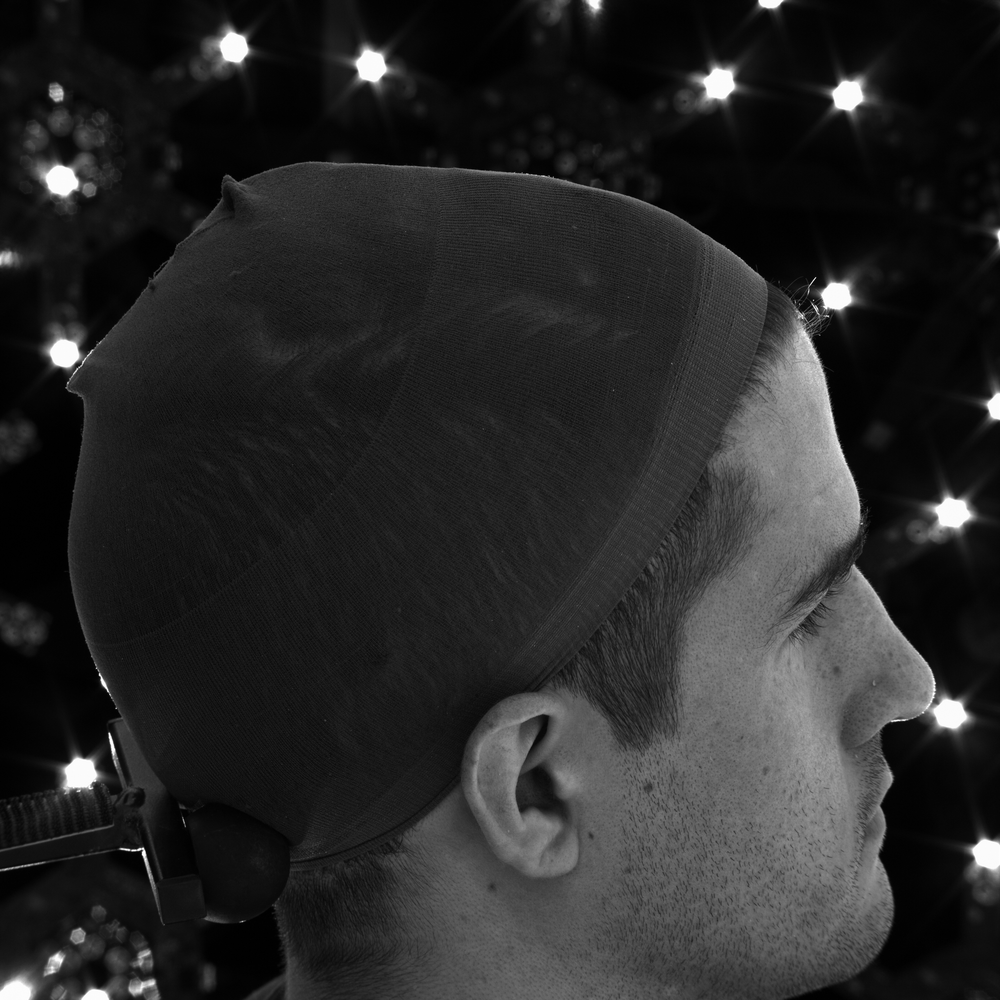
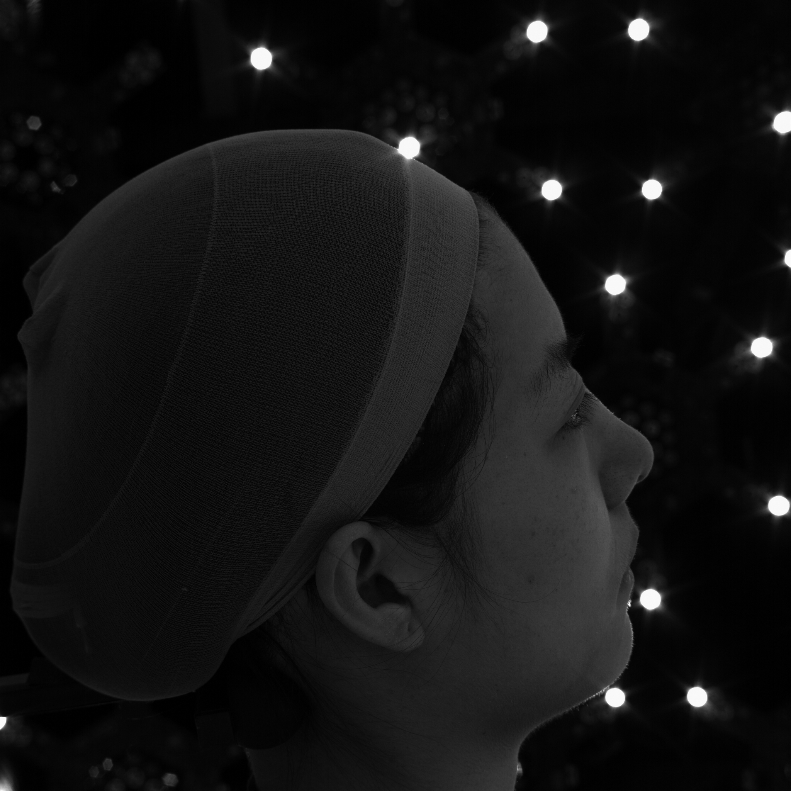
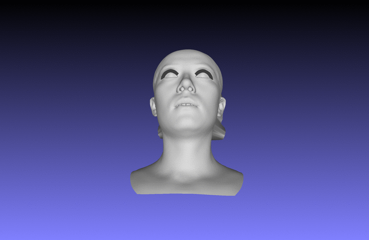

# HeadBack
This is a Project Code aiming to reconstruct head back from Light Stage Data.

## Example animation
The image on the left is the identity-preserved head back, right is the reconstruction result.
### Male
<p align='center'>
  
  
</p>

### Female with long hair
<p align='center'>
  
  
</p>

## Installation

The first part to reconstruct visualhull needs ```matlab``` and the second part needs ```python3```.

also, you need ```pip install``` or ```conda install``` package : [cgal](https://github.com/CGAL)

## How to use
  ### matlab 
   first get the sihousettle images(one channel) also camera parameters file (sfm), and simply try the scripts provided on visualhull folder
   (you may also need to change the path)
   second, you need to convert the .stl file to .obj by meshlab
  ### python
  after get the visualhull obj file, simply use the script ```python scripts.py --visualhull /your visualhullobj file --mesh /your original mesh --index_path the headback indexing file --output_dir output ```

## Additional notes
if you find any bugs or unclear stuff, please mail [yuminggu@usc.edu](mailto:yuminggu@usc.edu)
