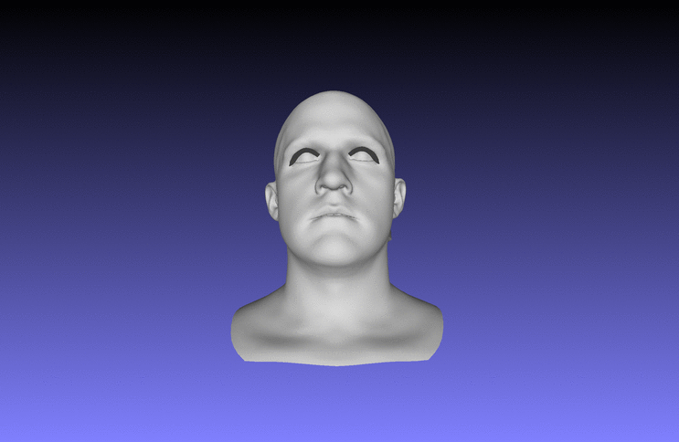

# HeadBack
This is a Project Code aiming to reconstruct head back from Light Stage Data.

## Example animation
The image on the left is the identity-preserved head back, right is the reconstruction result.
### Male

  
  

### Female with long hair

  
  

## Installation

The first part to reconstruct visualhull needs '''matlab''' and the second part needs '''python3'''.

also, you need '''pip install''' or '''conda install''' package :'''cgal'''

